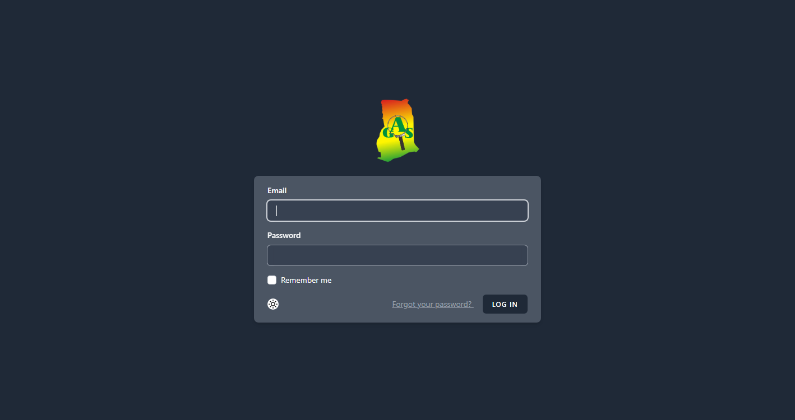
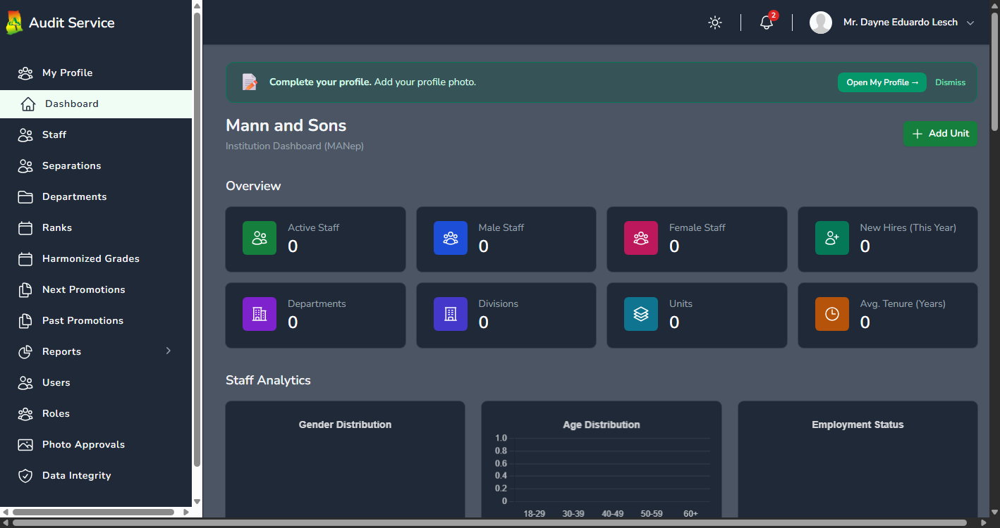
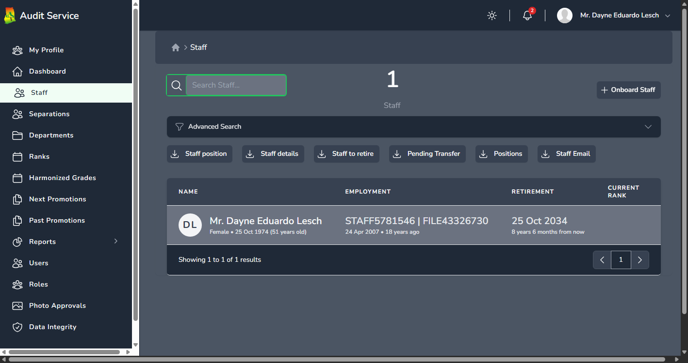
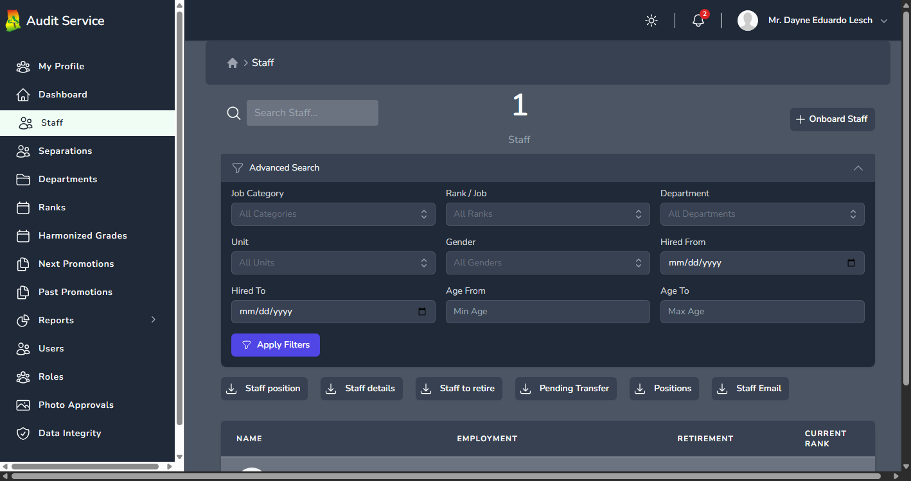
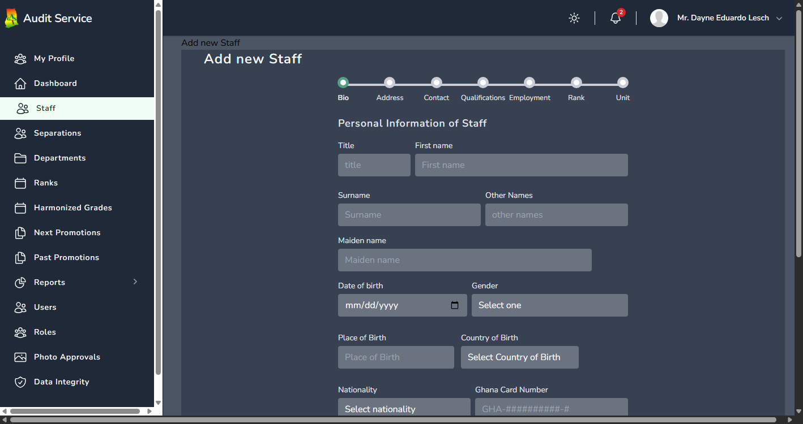

# HR Management System - User Guide

Welcome to the HR Management System (HRMIS). This guide will help you navigate and use the system effectively based on your role and responsibilities.

---

## Table of Contents

1. [Getting Started](#getting-started)
2. [User Roles Overview](#user-roles-overview)
3. [Dashboard & Navigation](#dashboard--navigation)
4. [Notifications](#notifications)
5. [Staff Directory](#staff-directory)
6. [My Profile](#my-profile)
7. [Staff Management](#staff-management)
8. [Photo Approvals](#photo-approvals)
9. [Units & Departments](#units--departments)
10. [Ranks & Job Categories](#ranks--job-categories)
11. [Staff Transitions](#staff-transitions)
12. [Qualifications Reports](#qualifications-reports)
13. [Reports & Exports](#reports--exports)
14. [User Management](#user-management)
15. [Data Integrity](#data-integrity)
16. [Common Tasks](#common-tasks)
17. [Frequently Asked Questions](#frequently-asked-questions)
18. [Getting Help](#getting-help)
19. [Keyboard Shortcuts](#keyboard-shortcuts)
20. [Glossary](#glossary)

---

## Getting Started

### Logging In

1. Open your web browser and navigate to the HRMIS login page
2. Enter your **Email Address** in the email field
3. Enter your **Password** in the password field
4. Click the **Log In** button

### First-Time Login - Changing Your Password

When you log in for the first time, you will be required to change your password before accessing the system.

1. After logging in, you will be redirected to the **Change Password** page
2. Enter your **Current Password**
3. Enter your **New Password** (must be at least 8 characters)
4. **Confirm** your new password by entering it again
5. Click **Update Password**

Your password has been changed and you can now access the system.

### Logging Out

1. Click on your **Profile Menu** in the top-right corner
2. Select **Sign Out**
3. You will be redirected to the login page

---

## User Roles Overview

The system has different user roles with varying levels of access. Here's what each role can do:

### Staff User
Regular employees with basic access to:
- View their own profile
- Update personal information, contacts, address, and qualifications via My Profile
- Upload a profile photo (subject to HR approval)
- View and manage their notifications
- View organizational structure
- Change their password

### Personnel User
Personnel management staff who can:
- View all staff records
- Update staff information
- View separated staff records

### HR User
Human Resources specialists with access to:
- View all staff records
- Create and manage staff qualifications
- Add staff notes (commendations, warnings, etc.)
- Process staff transfers
- Review and approve or reject staff photo submissions

### Admin User
Administrative users who can:
- All Personnel and HR capabilities
- Create new staff records
- Download staff data exports
- Process promotions and transfers
- Manage staff notes
- Access qualifications reports and exports

### Super Administrator
Full system access including:
- All administrative capabilities
- Manage user accounts and roles
- Configure permissions
- Access data integrity tools
- View audit logs
- Manage system settings
- All notification, profile, photo approval, and reporting capabilities

---

## Dashboard & Navigation

### Main Dashboard

After logging in, you'll see the main dashboard with:
- **Quick Statistics** - Overview of staff counts and key metrics
- **Recent Activity** - Latest system activities
- **Charts & Graphs** - Visual representations of staff data

### Main Navigation Menu

The main menu is located on the left side of the screen. Menu items visible to you depend on your role and permissions.

**Common Menu Items:**
- **Dashboard** - Return to the main dashboard
- **Staff** - Access the staff directory
- **Departments** - View organizational units
- **Ranks** - View job ranks and categories

**Administrative Menu Items (if accessible):**
- **Next Promotions** - Upcoming promotion batches
- **Past Promotions** - Historical promotion records
- **Reports** - Generate various reports
- **Users** - Manage user accounts
- **Roles** - Manage system roles
- **Audit Logs** - View system activity logs
- **Data Integrity** - Check and fix data issues

### Breadcrumb Navigation

At the top of each page, you'll see breadcrumb links showing your current location:

`Home > Staff > John Doe`

Click on any breadcrumb link to navigate back to that section.

---

## Notifications

The system keeps you informed about approvals, status changes, and important updates through in-app notifications.

### Notification Bell

A bell icon is always visible in the top-right area of the page header.

- A **red badge** appears on the bell showing your unread notification count (displays "9+" when there are more than 9)
- Click the bell to open a **dropdown** showing your 10 most recent notifications
- Each notification displays an icon, title, description, and relative time (e.g., "2 hours ago")
- Click the **X** button on any notification to dismiss it
- Click **Mark all as read** to clear all unread notifications at once
- Click on a notification to navigate directly to the related item (e.g., a staff profile or approval)

### Notifications Page

For a full view of all your notifications:

1. Click **View all** at the bottom of the notification bell dropdown, or navigate to the Notifications page from the menu
2. You'll see a paginated list of all your notifications (20 per page)
3. **Filter by status** using the tab buttons at the top:
   - **All** — every notification
   - **Unread** — only unread notifications
   - **Read** — only read notifications
4. **Filter by type** using the dropdown to narrow by notification category (e.g., photo approvals, qualifications)
5. For each notification you can:
   - Click the **check mark** to mark it as read
   - Click the **delete** button to remove it
   - Click on the notification title or body to mark it as read and navigate to the related content

> **Note:** You can only see your own notifications. Each user's notification list is private.

---

## Staff Directory

### Viewing the Staff List

1. Click **Staff** in the main menu
2. You'll see a paginated list of all staff members
3. Each row shows:
   - Staff photo
   - Name
   - Staff Number
   - Current Rank
   - Current Unit
   - Status

### Searching for Staff

**Basic Search:**
1. Use the search box at the top of the staff list
2. Type a name, staff number, or file number
3. Results will filter automatically as you type

**Advanced Search:**
1. Click the **Advanced Search** button
2. Use the filter options:
   - **Rank** - Filter by job rank
   - **Category** - Filter by harmonized grade category
   - **Unit** - Filter by organizational unit
   - **Department** - Filter by parent department
   - **Gender** - Filter by gender
   - **Status** - Filter by employment status
   - **Hire Date Range** - Filter by when staff were hired
   - **Age Range** - Filter by staff age
3. Click **Apply Filters** to see results
4. Active filters appear as badges that you can click to remove individually

### Viewing Staff Details

1. Click on a staff member's name in the list
2. You'll see their full profile including:
   - Personal information
   - Employment details
   - Current unit and rank
   - Contact information
   - Qualifications
   - Employment history

---

## My Profile

My Profile is your personal dashboard for viewing and managing your staff information. It uses a card-based layout with sections you can edit and sections managed by HR.

### Accessing My Profile

1. Click on your **Profile Menu** in the top-right corner
2. Select **My Profile**
3. You'll see your profile organized into cards

### Profile Photo

You can upload or change your profile photo from the photo card:

1. Click on the photo card or the **Upload** button
2. Drag and drop an image or click to browse your files
3. Requirements: **JPG or PNG** format, maximum **2 MB**
4. After uploading, your photo enters a **"Pending review"** state
5. An HR administrator will review and approve or reject your submission
6. You'll receive a **notification** when your photo is approved or rejected
7. To remove your current photo, click the **Remove** button

> **Note:** Your photo won't change immediately after upload. It must be approved by HR first. You can see the pending status and timestamp on your photo card.

### Contact Information

You can manage your phone numbers and email addresses:

1. Scroll to the **Contact** card on your profile
2. To **add** a contact:
   - Click **Add Contact**
   - Select the type (Phone or Email)
   - Enter the details
   - Click **Save**
3. To **edit** a contact, click the edit icon next to it
4. To **delete** a contact, click the delete icon

> **Restrictions:** You cannot delete your last phone number or your organizational email address (e.g., @audit.gov.gh).

### Address

You can add or update your address:

1. Scroll to the **Address** card on your profile
2. If no address exists, click **Add Address**
3. To update an existing address, click **Edit** or **Change**
4. Fill in the fields:
   - **Address Line 1** (required)
   - Address Line 2
   - **City** (required)
   - Region
   - Country
   - Post Code
5. Click **Save**

### Qualifications

You can manage your own qualifications, which may require HR approval:

1. Scroll to the **Qualifications** card on your profile
2. To **add** a qualification:
   - Click **Add Qualification**
   - Enter: qualification name, institution, year obtained, level, and course
   - Click **Save**
3. Each qualification shows a status badge:
   - **Approved** (green) — verified by HR
   - **Pending** (amber) — awaiting HR review
4. To **attach documents** (certificates, transcripts), click the attach icon on a qualification
5. To **view details**, click on the qualification name
6. To **delete** a qualification (if permitted), use the delete button

### HR-Managed Information (Read-Only)

The following sections are visible on your profile but can only be updated by HR:

- **Personal Details** — date of birth, gender, nationality, religion, marital status, identity documents
- **Employment Information** — hire date, current rank, current unit/department
- **Dependents** — registered family members (spouse, children, parents)

To update any of these fields, contact your HR department.

### Changing Your Password

1. Click on your **Profile Menu** in the top-right corner
2. Select **Change Password**
3. Enter your **Current Password**
4. Enter your **New Password**
5. **Confirm** your new password
6. Click **Update Password**

---

## Staff Management

*This section is for users with staff management permissions (HR, Admin, Super Admin)*

### Creating a New Staff Record

1. Navigate to **Staff** in the main menu
2. Click the **Add Staff** button
3. Fill in the required information:

   **Personal Information:**
   - Title (Mr., Mrs., Ms., etc.)
   - First Name
   - Surname
   - Other Names
   - Date of Birth
   - Gender
   - Nationality
   - Marital Status

   **Employment Information:**
   - Staff Number
   - File Number
   - Hire Date
   - Initial Rank
   - Initial Unit

4. Click **Create Staff** to save

### Updating Staff Information

1. Navigate to the staff member's profile
2. Click **Edit** on the section you want to update
3. Make your changes
4. Click **Save**

### Managing Staff Contacts

1. Navigate to the staff member's profile
2. Scroll to the **Contacts** section
3. To add a contact:
   - Click **Add Contact**
   - Select contact type (Phone, Email, Emergency)
   - Enter the contact details
   - Click **Save**
4. To edit or delete, use the action buttons next to each contact

### Managing Dependents

1. Navigate to the staff member's profile
2. Scroll to the **Dependents** section
3. Click **Add Dependent**
4. Enter dependent information:
   - Name
   - Relationship (Spouse, Child, Parent, etc.)
   - Date of Birth
   - Contact details
5. Click **Save**

### Adding Qualifications

1. Navigate to the staff member's profile
2. Scroll to the **Qualifications** section
3. Click **Add Qualification**
4. Enter qualification details:
   - Course/Programme
   - Institution
   - Qualification Type
   - Year Obtained
5. Optionally upload supporting documents
6. Click **Save**

### Uploading Documents

1. Navigate to the staff member's profile
2. Scroll to the **Documents** section
3. Click **Upload Document**
4. Select the document type
5. Enter a title and description
6. Choose the file to upload
7. Click **Upload**

### Adding Staff Notes

Notes can be used to record commendations, warnings, or other important information.

1. Navigate to the staff member's profile
2. Scroll to the **Notes** section
3. Click **Add Note**
4. Select the note type:
   - Commendation
   - Warning
   - Disciplinary
   - General
5. Enter the note content
6. Click **Save**

---

## Photo Approvals

*This section is for users with the "approve staff photo" permission*

When staff members upload new profile photos, they must be reviewed and approved before becoming visible. The Photo Approvals page lets authorized users manage this queue.

### Accessing Photo Approvals

1. Navigate to **Photo Approvals** in the main menu
2. You'll see a table of all pending photo submissions
3. If there are no pending photos, the page shows "No pending photo submissions"

### Reviewing and Acting on Submissions

The table shows one row per pending submission with:
- **Staff Member** — name of the person who submitted the photo
- **Current Photo** — their existing approved photo (or "None" if they don't have one)
- **Pending Photo** — the new photo they uploaded (highlighted with an amber border)
- **Submitted** — when the photo was uploaded (e.g., "2 hours ago")

For each submission you have two options:

**To Approve:**
1. Click the **Approve** button (green)
2. The pending photo becomes the staff member's official profile photo
3. The staff member receives a notification that their photo was approved

**To Reject:**
1. Click the **Reject** button (red)
2. The pending photo is removed
3. The staff member receives a notification that their photo was rejected and may upload a new one

---

## Units & Departments

### Viewing the Organizational Structure

1. Click **Departments** (or **Units**) in the main menu
2. You'll see the hierarchical structure of the organization
3. Units are organized in a tree structure:
   - Institution
     - Departments
       - Divisions
         - Units

### Viewing Unit Details

1. Click on a unit name
2. View unit information including:
   - Unit name and description
   - Parent unit
   - Sub-units
   - Staff count
   - Rank distribution chart
   - Staff directory

### Viewing Unit Staff

1. Navigate to the unit's page
2. Scroll to the **Staff** section
3. View all staff assigned to this unit
4. Use the search and filter options if needed

### Downloading Unit Staff List

1. Navigate to the unit's page
2. Click the **Download Staff** button
3. An Excel file will be downloaded with all staff in that unit

---

## Ranks & Job Categories

### Viewing Job Ranks

1. Click **Ranks** in the main menu
2. View the list of all job ranks in the system
3. Each rank shows:
   - Rank name
   - Category (Harmonized Grade)
   - Staff count
   - Actions (if you have permission)

### Viewing Harmonized Grades (Job Categories)

1. Click **Harmonized Grades** in the main menu
2. View the list of all job categories
3. Each category groups related ranks together

### Viewing Staff by Rank

1. Navigate to a specific rank
2. View all staff members holding that rank
3. Filter options available:
   - Active staff
   - Staff due for promotion
   - All staff (including separated)

---

## Staff Transitions

*This section is for users with transition management permissions*

### Processing Transfers

**Creating a Transfer:**
1. Navigate to the staff member's profile
2. Click **Transfer** or go to the Transfers section
3. Select the **New Unit** the staff is transferring to
4. Enter the **Effective Date**
5. Add any **Remarks** (optional)
6. Click **Submit Transfer**

**Approving a Transfer:**
1. Navigate to the pending transfer
2. Review the transfer details
3. Click **Approve** to confirm or **Reject** to decline
4. The staff member's unit assignment will be updated

### Processing Promotions

**Individual Promotion:**
1. Navigate to the staff member's profile
2. Click **Promote** or go to the Promotions section
3. Select the **New Rank**
4. Enter the **Effective Date**
5. Add any **Remarks** (optional)
6. Click **Submit Promotion**

**Batch Promotions:**
1. Navigate to **Next Promotions** in the main menu
2. View staff eligible for promotion
3. Select staff to promote
4. Confirm the new rank and date
5. Click **Promote Selected**

### Viewing Promotion History

1. Navigate to **Past Promotions** in the main menu
2. Filter by year or rank
3. View historical promotion records
4. Download promotion reports if needed

### Managing Separations

When a staff member leaves the organization:

1. Navigate to the staff member's profile
2. Click **Change Status** or go to the Status section
3. Select the separation type:
   - Retired
   - Resigned
   - Deceased
   - Terminated
   - Dismissed
   - Suspended
   - Leave (with/without pay)
4. Enter the **Effective Date**
5. Add any **Remarks**
6. Click **Save**

### Viewing Separated Staff

1. Navigate to **Staff** in the main menu
2. Click on **Separated Staff** or **Separations** tab
3. View all staff who have left the organization
4. Filter by separation type if needed

---

## Qualifications Reports

*This section is for users with the "qualifications.reports.view" permission*

The Qualifications Reports module provides a comprehensive dashboard for analysing staff qualifications across the organization.

### Accessing Qualifications Reports

1. Navigate to **Qualifications** > **Reports** in the main menu
2. You must have the **qualifications.reports.view** permission
3. Exporting reports additionally requires the **qualifications.reports.export** permission

### KPI Dashboard

At the top of the page, four summary cards give you an at-a-glance overview:

1. **Total Qualifications** — count of qualifications matching your current filters, with trend over time
2. **Staff Covered** — number and percentage of active staff who have at least one qualification
3. **Pending** — qualifications awaiting approval, with the age of the oldest pending item
4. **Staff Without Qualifications** — count and percentage of active staff with no qualifications (useful for identifying training needs)

### Filtering Reports

Use any combination of filters to narrow your results (all are optional):

- **Department** — select an organizational department
- **Unit** — units update automatically based on selected department
- **Qualification Level** — filter by credential type (Degree, Diploma, Certificate, etc.)
- **Status** — filter by approval status (Approved, Pending, etc.)
- **Gender** — filter by Male or Female
- **Year Range** — set a start and/or end year
- **Institution** — search by school or university name
- **Course** — search by course or programme name

Filters apply automatically as you select them. Active filters appear as **badges** that you can click to remove individually.

### Report Types

Select a report type from the dropdown:

1. **Staff List** — detailed individual qualification records
2. **By Unit** — qualifications aggregated by organizational unit
3. **By Level** — qualifications aggregated by credential level
4. **Gaps** — staff who have no qualifications, useful for training needs analysis

### Charts & Visualizations

Six interactive charts are available below the KPI cards:

1. **Qualification Level Distribution** — breakdown by level
2. **Highest Level by Gender** — comparison of male vs. female staff
3. **Qualifications by Unit** — breakdown by organizational unit
4. **Acquired Over Time** — trend of qualifications gained year-over-year
5. **Top Institutions** — most common schools and universities
6. **Top Qualifications** — most common courses and degrees

Each chart can be **expanded to full screen** and supports toggling between count and percentage views.

### Exporting Reports

To export data as PDF or Excel:

1. Click the **PDF** or **Excel** export button
2. Select the report type from the dropdown (Staff List, By Unit, By Level, or Gaps)
3. The export will include only the data matching your current filters
4. The file downloads automatically

> **Note:** Exporting requires the **qualifications.reports.export** permission in addition to the view permission.

---

## Reports & Exports

*This section is for users with report viewing permissions*

### Available Reports

The system provides various reports:

**Staff Reports:**
- Active Staff Report
- Staff Details Report
- Staff Positions Report
- Staff to Retire Report
- Pending Transfers Report

**Separation Reports:**
- All Retirements
- Deceased Staff
- Terminated Staff
- Resignations
- Suspended Staff
- Dismissed Staff
- Leave Reports

**Promotion Reports:**
- Past Promotions (by year)
- Promotions by Rank
- Next Promotions Batch

**Recruitment Reports:**
- Recruitment Data
- Recruitment Charts

### Generating a Report

1. Navigate to **Reports** in the main menu
2. Select the report type you want to generate
3. Apply any filters:
   - Date range
   - Unit/Department
   - Rank/Category
   - Status
4. Click **Generate Report**

### Exporting Data

Most reports can be exported to Excel:

1. Generate the report as described above
2. Click the **Export** or **Download** button
3. Choose the export format (usually Excel)
4. The file will download automatically

### Common Exports

- **Active Staff Export** - All current active staff
- **Separated Staff Export** - All separated staff by category
- **Unit Staff Export** - Staff list for a specific unit
- **Promotion List Export** - Staff due for promotion
- **Position Report Export** - Staff with their positions

---

## User Management

*This section is for Super Administrators*

### Creating a User Account

1. Navigate to **Users** in the main menu
2. Click **Add User**
3. Enter user information:
   - Name
   - Email Address
   - Password (temporary)
   - Role Assignment
4. Click **Create User**
5. The user will be required to change their password on first login

### Managing User Roles

1. Navigate to the user's profile
2. Click **Manage Roles**
3. Assign or remove roles:
   - Staff
   - Personnel User
   - HR User
   - Admin User
   - Super Administrator
4. Click **Save**

### Managing User Permissions

For granular access control:

1. Navigate to the user's profile
2. Click **Manage Permissions**
3. Assign or remove individual permissions
4. Click **Save**

### Resetting a User's Password

1. Navigate to the user's profile
2. Click **Reset Password**
3. Enter a new temporary password
4. Click **Reset**
5. Inform the user of their new password

### Managing Roles

1. Navigate to **Roles** in the main menu
2. View existing roles and their permissions
3. To create a new role:
   - Click **Add Role**
   - Enter the role name
   - Assign permissions
   - Click **Create**

---

## Data Integrity

*This section is for Super Administrators*

The Data Integrity module helps identify and fix data issues in the system.

### Available Checks

- **Multiple Rank Assignments** - Staff with more than one active rank
- **Staff Without Units** - Staff not assigned to any unit
- **Staff Without Ranks** - Staff without a rank assignment
- **Invalid Date Ranges** - Records with end dates before start dates
- **Active Separated Staff** - Staff marked as separated but still showing as active
- **Multiple Active Units** - Staff assigned to multiple units simultaneously
- **Staff Without Profile Pictures** - Staff records missing photos
- **Staff Without Gender** - Staff records with missing gender data
- **Expired Active Status** - Staff with expired active status dates that need review
- **Pending Qualifications** - Qualifications submitted by staff that are awaiting HR review and approval

### Running Data Checks

1. Navigate to **Data Integrity** in the main menu
2. View the list of available checks
3. Click on a check to see affected records
4. Each check shows:
   - Number of affected records
   - List of staff with issues
   - Suggested fixes

### Fixing Data Issues

1. Navigate to the specific data check
2. Review the affected records
3. For individual fixes:
   - Click **Fix** next to the record
   - Review the proposed change
   - Confirm the fix
4. For bulk fixes:
   - Select multiple records
   - Click **Fix Selected**
   - Confirm the bulk fix

---

## Common Tasks

### How to Search for a Staff Member

1. Go to **Staff** in the main menu
2. Use the search box to type their name or staff number
3. Press Enter or wait for results to appear
4. Click on their name to view their profile

### How to Export Staff Data

1. Navigate to **Staff** or a specific **Unit**
2. Apply any filters you need
3. Click the **Export** or **Download** button
4. The Excel file will download automatically

### How to Change Your Password

1. Click your profile menu (top-right)
2. Select **Change Password**
3. Enter current password
4. Enter and confirm new password
5. Click **Update Password**

### How to Find Staff Due for Promotion

1. Go to **Next Promotions** in the menu
2. View staff eligible for promotion
3. Filter by rank or date if needed

### How to View Separated Staff

1. Go to **Staff** in the main menu
2. Click on **Separations** or **Separated Staff** tab
3. Use filters to find specific separation types

### How to Download a Unit's Staff List

1. Navigate to **Departments/Units**
2. Click on the specific unit
3. Click **Download Staff** button
4. Excel file will download with all unit staff

---

## Frequently Asked Questions

### General Questions

**Q: I forgot my password. What do I do?**
A: Click the "Forgot Password" link on the login page and follow the instructions to reset your password. If you don't receive the reset email, contact your system administrator.

**Q: Why can't I see certain menu items?**
A: Menu items are displayed based on your role and permissions. If you need access to additional features, contact your administrator.

**Q: How do I update my profile photo?**
A: Navigate to your profile, click on your current photo or the "Upload Photo" option, select a new image, and save.

### Staff Management Questions

**Q: How do I correct a staff member's date of birth?**
A: Navigate to their profile, click Edit on the personal information section, correct the date, and save.

**Q: Can I delete a staff record?**
A: Staff records are soft-deleted for audit purposes. Only administrators can delete records, and deleted records can be restored if needed.

**Q: How do I record a staff death?**
A: Navigate to the staff profile, click "Change Status", select "Deceased", enter the date, and save.

### Reports Questions

**Q: Why is my export taking so long?**
A: Large exports are processed in the background. For very large datasets, you may receive an email when the export is ready.

**Q: Can I schedule automatic reports?**
A: Currently, reports must be generated manually. Contact your administrator about scheduling requirements.

### Technical Questions

**Q: The page is loading slowly. What should I do?**
A: Try refreshing the page. If the problem persists, clear your browser cache or contact your IT support.

**Q: I see an error message. What should I do?**
A: Note the error message, take a screenshot if possible, and report it to your system administrator.

---

## Getting Help

### In-App Support

- Look for help icons (?) throughout the application for context-specific guidance
- Hover over fields and buttons for tooltips with additional information

### Contact Support

If you need assistance:

1. **Document the Issue:**
   - What were you trying to do?
   - What error message did you see (if any)?
   - Take a screenshot if possible

2. **Contact Your Administrator:**
   - Email your system administrator
   - Provide the details documented above
   - Include your username and the approximate time the issue occurred

### Reporting Bugs

If you find a bug or issue in the system:

1. Note the exact steps to reproduce the problem
2. Take screenshots of any error messages
3. Report to your system administrator with all details

### Feature Requests

Have an idea to improve the system?

1. Document your suggestion clearly
2. Explain how it would help your work
3. Submit to your system administrator for consideration

---

## Keyboard Shortcuts

| Shortcut | Action |
|----------|--------|
| `Ctrl + /` or `Cmd + /` | Open search |
| `Escape` | Close dialogs/modals |
| `Enter` | Submit forms |
| `Tab` | Navigate between form fields |

---

## Glossary

| Term | Definition |
|------|------------|
| **Staff** | An employee record in the system |
| **Unit** | An organizational division (department, division, section) |
| **Rank** | A job grade or level (e.g., Senior Officer, Principal Officer) |
| **Harmonized Grade** | A category grouping similar ranks across different job families |
| **Transfer** | Moving a staff member from one unit to another |
| **Promotion** | Advancing a staff member to a higher rank |
| **Separation** | When a staff member leaves the organization (retirement, resignation, etc.) |
| **Dependent** | A family member of a staff (spouse, child, parent) |
| **Qualification** | Educational or professional credentials |

---

*Last Updated: December 2024*

*HR Management System - Version 2024.12*
